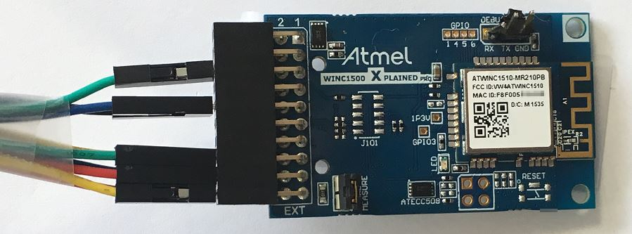

# STM32F429ZI_NUCLEO_144_AP_MODE
> Adding Embedded Wi-Fi Connectivity to a Cortex-M4 Microcontroller

This sample application code demonstrates how to enter Access Point (AP) mode
using the Microchip WINC1500 Wi-Fi module connected to an STM32F429ZI Host MCU.

For more information on Microchip WINC1500 Wi-Fi Module, visit Microchip webpage: http://www.microchip.com/atwinc1500
For more information on STM32F249ZI MCU, visit ST webpage: https://www.st.com/en/microcontrollers/stm32f429zi.html


## Software

- Atollic TrueSTUDIO v9.0.0 has been used on Windows for this project. </br>
To download the IDE, visit http://www.atollic.com/truestudio/

- TeraTerm terminal emulator </br>
To download the program, visit https://ttssh2.osdn.jp/index.html.en


## Hardware Setup

STM32 Nucleo-144 development board with STM32F429ZI MCU
STM32 Nucleo-144 board does not require any debug probe as it integrates the ST-LINK/V2-1 debugger/programmer.</br>
The USB connector CN1 will be used to power supply the board, program the MCU and interact with the serial console.</br>
More information available:  https://www.st.com/en/evaluation-tools/nucleo-f429zi.html


The ATWINC1500-XPRO extension board allows you to evaluate the Microchip WINC1500 WiFi module.</br>
More information available: https://www.microchip.com/DevelopmentTools/ProductDetails/ATWINC1500-XPRO



## Tutorial

- Start Atollic TrueSTUDIO IDE

- Import an existing project

- Browse your hard disk to select the project folder of this sample code

- Open inc/main.h to change the AP credentials:</br>
```
/** Security mode */
#define USE_WEP					 (0) /*< Set to (1) to use WEP, and (0) to use OPEN */

/** AP mode Settings */
#define MAIN_WLAN_SSID           "DEMO_AP" /* < SSID */
#if USE_WEP
#define MAIN_WLAN_AUTH           M2M_WIFI_SEC_WEP /* < Security manner */
#define MAIN_WLAN_WEP_KEY        "1234567890" /* < Security Key in WEP Mode */
#define MAIN_WLAN_WEP_KEY_INDEX  (0)
#else
#define MAIN_WLAN_AUTH           M2M_WIFI_SEC_OPEN /* < Security manner */
#endif
#define MAIN_WLAN_CHANNEL        (6) /* < Channel number */
```
- Open main.c file to change the IP address of the AP if required:</br>
```
/* Initialize AP mode parameters structure with SSID, channel and OPEN security type. */
	memset(&strM2MAPConfig, 0x00, sizeof(tstrM2MAPConfig));
	strcpy((char *)&strM2MAPConfig.au8SSID, MAIN_WLAN_SSID);
	strM2MAPConfig.u8ListenChannel = MAIN_WLAN_CHANNEL;
	strM2MAPConfig.u8SecType = MAIN_WLAN_AUTH;

	strM2MAPConfig.au8DHCPServerIP[0] = 192;
	strM2MAPConfig.au8DHCPServerIP[1] = 168;
	strM2MAPConfig.au8DHCPServerIP[2] = 1;
	strM2MAPConfig.au8DHCPServerIP[3] = 1;
}
```
- Open TeraTerm program a create a serial connection with the following parameters:</br>
115200bps, 8 bit, no parity, 1 stop bit

- Build project, if everything is set correctly build finishes without errors</br>

- Open the Debug Configurations window and make sure ST-LINK is selected as a debug probe with SWD interface</br>

- Start debug/program the code into your board</br>

- Run the code

- You should now be able to see serial traces on the TeraTerm console

